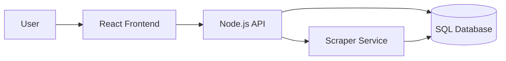
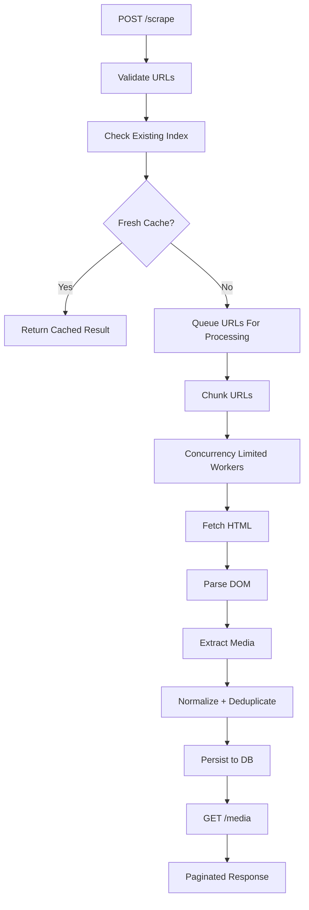
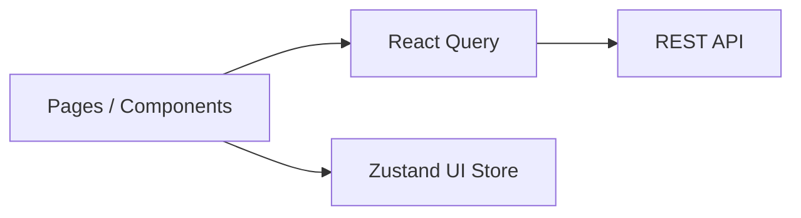

# Architecture & System Design

## High Level Overview

### User Journey
1. User opens gallery.
2. Existing indexed media is loaded.
3. User submits URLs.
4. Backend checks cache / freshness.
5. New or stale URLs are processed.
6. Results are stored.
7. Gallery refreshes.

## Key Design Decisions / Edge Cases

### Empty First Visit
If no data exists, the backend returns an empty array with pagination metadata. The frontend renders an empty-state CTA.

### Repeated URLs
Previously indexed URLs use a caching strategy:
- Fresh data → return immediately.
- Stale data → return cached data + refresh in background.
- New URL → scrape now.

### Resource Constraints (1 CPU / 1GB RAM)
To handle throughput requirements (~5000 concurrent requests) under constraints, we use **controlled concurrency**:
- Process URLs in batches.
- Cap active workers.
- Keep memory usage stable.

## Backend Deep Dive

### Service Flow

### Tech Stack Decisions
| Layer | Choice | Reason |
| --- | --- | --- |
| Runtime | Node.js + TypeScript | Strong async I/O, shared language. |
| Framework | NestJS | Lightweight, fast setup. |
| HTML Parsing | Cheerio | Simple selectors, lightweight. |
| Database | MySQL | Relational queries fit pagination/filtering. |

---

## Frontend Deep Dive

### Architecture

### Tech Stack Decisions
| Tool | Purpose | Reason |
| --- | --- | --- |
| React + TypeScript | UI Foundation | Component architecture, typing. |
| React Query | Server State | Fetching, caching, pagination. |
| Zustand | Client UI State | Lightweight store for local state. |
| Tailwind CSS | Styling | Rapid development, responsive. |
| Biome | Toolchain | Fast linting/formatting. |
