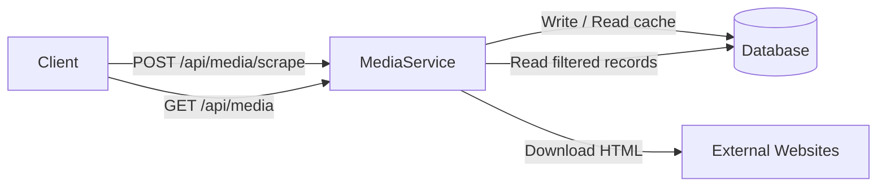
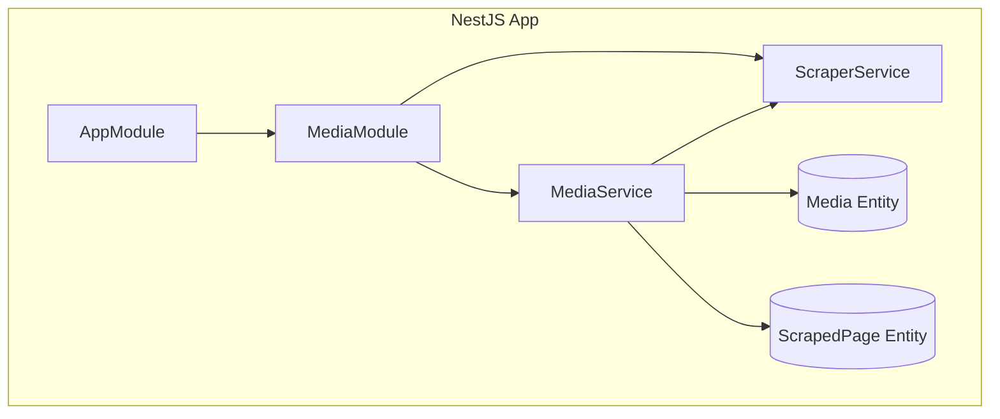
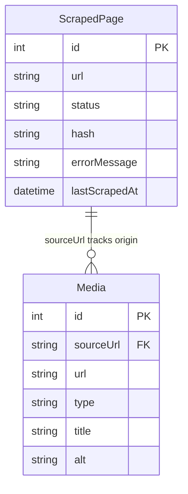

# Backend System Design — Media Scraper

## 1. Requirements

### 1.1 Functional Requirements

| # | System can... |
|---|---|
| F1 | Accept a list of URLs and scrape media (images and videos) from them |
| F2 | Provide paginated and sortable media results |
| F3 | Filter media by type and search by keyword across URLs, titles, and alt text |

### 1.2 Non-Functional Requirements

| # | Quality | Target |
|---|---|---|
| NF1 | **Throughput** | Handle 5,000 simultaneous HTTP requests |
| NF2 | **Memory** | Run within 1 GB RAM |
| NF3 | **Data freshness** | Serve cached results for up to 24 hours to prevent unnecessary re-fetching |

---

## 2. Tech Stack

| Layer | Choice | Why |
|---|---|---|
| **Framework** | NestJS | DI + Module architecture, built-in Swagger natively |
| **HTTP client** | Axios | Timeout config, robust status handling |
| **HTML parser** | Cheerio | Fast jQuery-like dom parsing API, zero headless browser RAM overhead |
| **ORM & DB** | TypeORM & MySQL 8 | Relational integrity mappings and rapid feature iterations |

---

## 3. High-Level Flow

At a high level, the `MediaService` directly handles two primary functional operations coming from clients: scraping new URLs and reading existing records from database:

---

## 4. Architecture & Data Model

### 4.1 Module Architecture

| Module / Component | Purpose |
|---|---|
| **AppModule** | The root application module that loads DB configuration and registers all sub-modules. |
| **MediaModule** | Groups all media-related logic, pulling in the services and TypeORM entities. |
| **MediaService** | The core business logic layer. Manages incoming API requests, scraping coordination, database persistence, and queries. |
| **ScraperService** | A utility service solely responsible for downloading and parsing HTML into media objects. |
| **Entities** | Define the database schema mappings (`media` and `scraped_pages`). |

### 4.2 Database Schema

The system uses a relational model inside MySQL.

---

## 5. Core Logic: Scraping & Caching

Scraping is the core focus of the system. Architecture around reliable extraction and simplified caching workflows are applied.

### 5.1 Detailed Scraping Workflows
- **Batch Processing**: When client submits multiple URLs, the system loops through them **sequentially**. This serves as an implicit outbound rate limit, preventing the system from accidentally hammering a target external server with massive parallel GET requests.
- **Fetching HTML**: Uses Axios to download static HTML content.
- **DOM Parsing & Extraction**: Cheerio loads the DOM. The scraper recursively searches and extracts elements matching tags like ``, `<video>`, and `<source>`.
- **Filtering Noise**: The raw extracted array is heavily filtered to discard non-valuable items:
  - Base64 `data:` URIs (pollute the DB footprint).
  - Known tracking pixels (e.g., 1x1 width inline styling).
  - Invalid protocols like `javascript:` or `#`.
- **URL Normalization**: Resolves paths missing hostnames (like `/assets/logo.png`) into absolute URLs relying on the originally evaluated destination host context.
- **Upsert Execution**: For every successful scrape, the system clears stale media tied to that `sourceUrl`, deduplicates the array of extracted assets in-memory, and performs a bulk insert for high transactional performance.

### 5.2 Caching Strategy & Architecture Decision
- **Algorithm**: The scraper checks the `scraped_pages` table before initiating a network fetch. If a `SUCCESS` status is found that is less than 24 hours old, the scraper bypasses downloading HTML entirely.
- **Database Indexing**: To achieve the high-speed read performance typical of in-memory caches, we utilize database indexes on the `url` column. This enables highly efficient cache-hit verification directly at the database layer.
- **Design Decision — No Redis Layer**: Skip an external memory cache like Redis for a **Single Source of Truth and Simplicity** pattern.

---

## 6. Security & Error Handling

### 6.1 Rate Limiting
To protect against system abuse and unintentional infinite loops from the frontend, the backend is secured with `@nestjs/throttler`.
- **Global Limit**: The API endpoints enforce a strict maximum of **100 requests per minute** per client connection across all APIs.
- **Load Testing**: Provide a load test script (`load-test.js`) to simulate heavy traffic for this service.

### 6.2 Error Code Cases

| HTTP Status | Context | Response Meaning |
|-------------|---------|------------------|
| **200 OK** | `GET` APIs | Successful retrieval of paginated media data or the distinct scraped pages list. |
| **202 Accepted** | `POST` Scrape | The scraping batch process executed. Instead of dropping the whole request if one URL out of five fails, the API gracefully accepts the request and returns specific failing URLs in a subset `failedUrls` array back to the UI. |
| **400 Bad Request** | All APIs | Input payload validation failed (e.g., malformed URL syntax, empty body array, invalid numerical pagination filters). |
| **403 Forbidden** | Axios (Internal) | The target external server explicitly refused connection via captchas or bot-nets protections (captured gracefully so the app does not crash internally). |
| **429 Too Many Req.** | All APIs | The client IP has exceeded the 100 requests/minute global rate limit threshold. |
| **500 Server Error** | All APIs | Complete unhandled application crash or unforeseen MySQL database downtime. |

---

## 7. API Reference

| Method | Path | Description |
|---|---|---|
| `POST` | `/api/media/scrape` | Trigger scrape for a batch payload list of URLs → returns 202 |
| `GET` | `/api/media` | List paginated & searched/filtered media |
| `GET` | `/api/media/scraped-pages` | Distinct scraped pages grouped tightly by domain name |
| `GET` | `/api/docs` | Built-in Swagger API Documentation landing page UI |

---

## 8. Acknowledged Limitations

- **Concurrency**: Batch processing currently fetches URLs sequentially. Implementing concurrent fetching and processing could significantly reduce latency for larger batches of URLs.
- **Dynamic Content Extraction**: The scraper relies on static HTML parsing (`cheerio`). Media elements loaded dynamically via client-side JavaScript execution (e.g., in modern SPAs) may not be captured.
