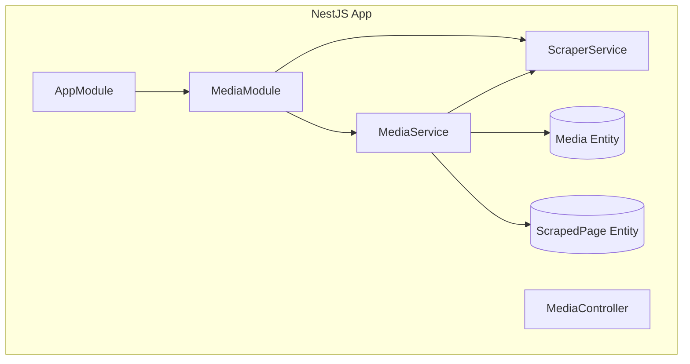
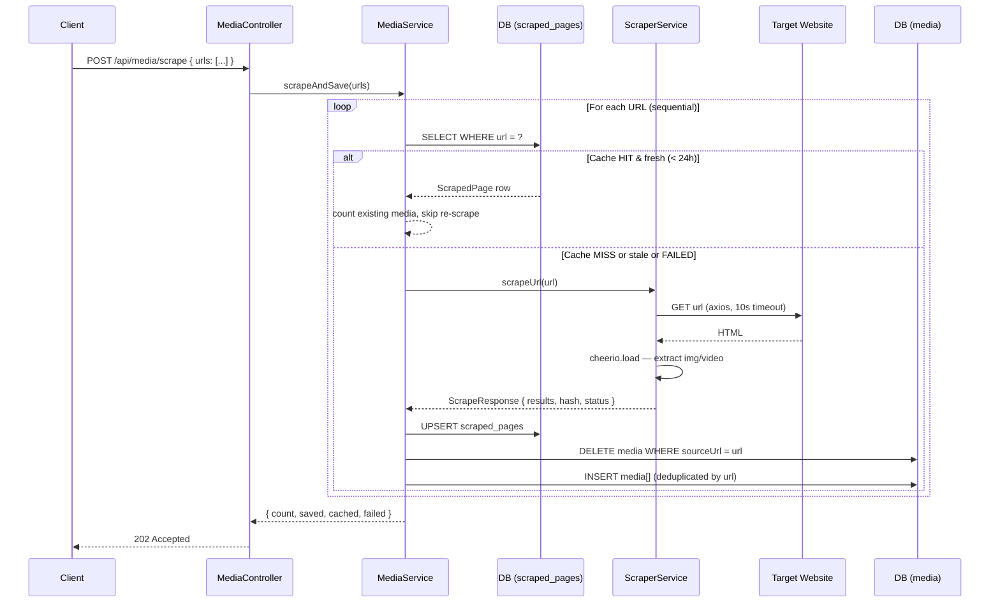
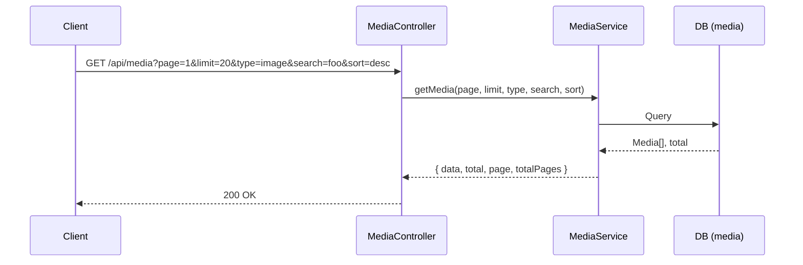
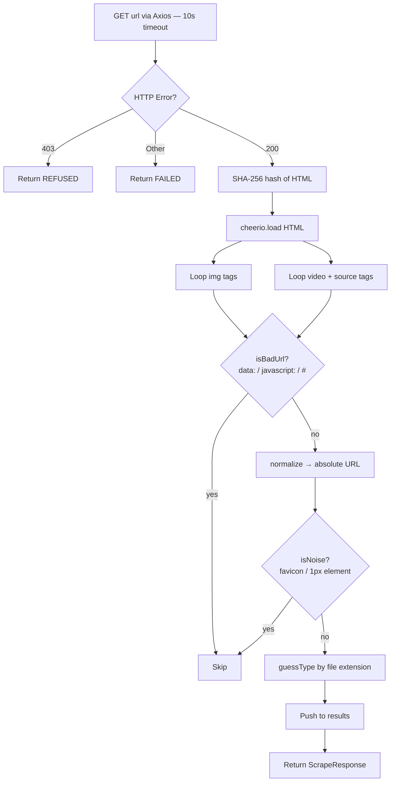
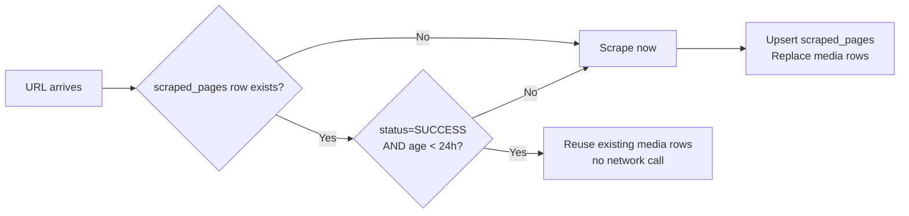
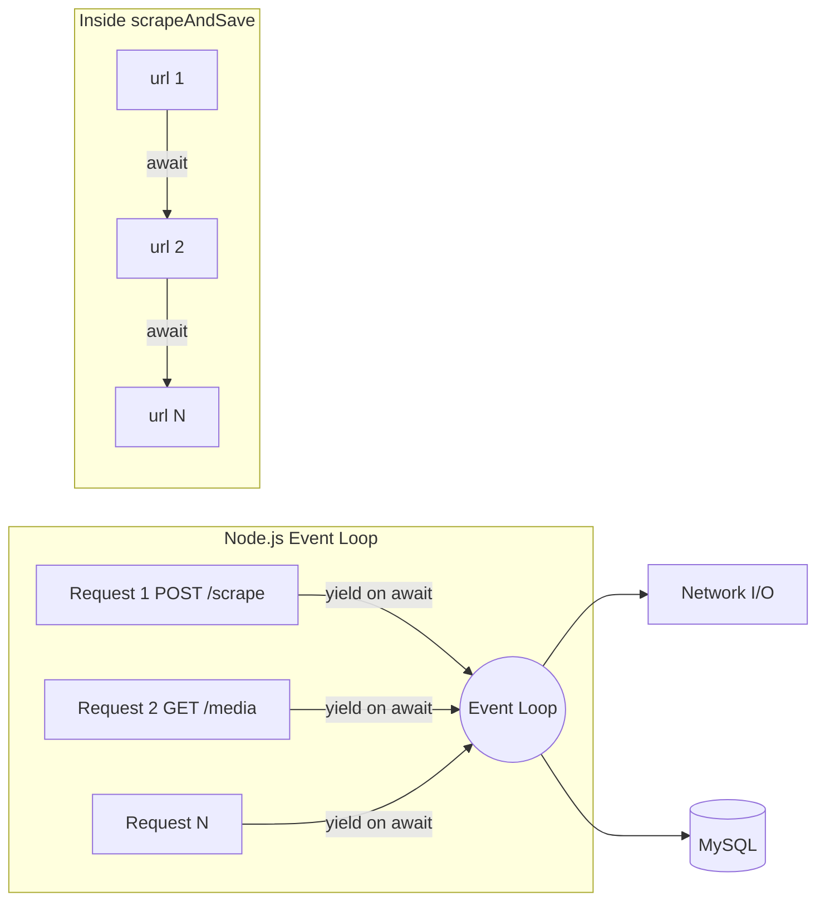
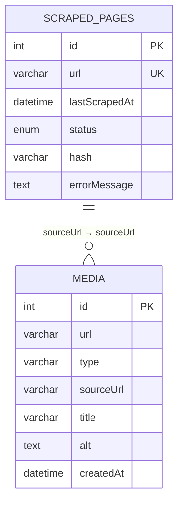

# Backend System Design — Media Scraper

## 1. Requirements

### 1.1 Functional Requirements

What the backend currently does:

| # | Feature | Endpoint |
|---|---|---|
| F1 | Accept a list of URLs and scrape `` / `<video>` media from each | `POST /api/media/scrape` |
| F2 | Return paginated, filterable, sortable media results | `GET /api/media` |
| F3 | Filter by media type (`image` / `video` / `all`) and free-text search across URL, title, alt | `GET /api/media?type=&search=` |

### 1.2 Non-Functional Requirements

| # | Requirement | Target | Current Reality |
|---|---|---|---|
| NF1 | **Throughput** | Handle 5 000 simultaneous HTTP requests | ~200–500 concurrent reads before DB I/O saturates; scrape requests bottleneck on sequential I/O + V8 heap |
| NF2 | **Memory** | Run within 1 GB RAM | Single Node.js process uses ~150–300 MB idle; OOM risk at high concurrent scrape volume (full HTML buffered per request) |
| NF3 | **Data freshness** | Cached results served for up to 24 h | Hard-coded TTL; no manual cache invalidation API |

---

## 2. Tech Stack

| Layer | Choice | Why |
|---|---|---|
| **Framework** | NestJS 11 | Opinionated DI + module system; Swagger built-in; mirrors Angular patterns FE devs recognise |
| **HTTP client** | Axios | Timeout config, interceptors, straightforward error classification |
| **HTML parser** | Cheerio | jQuery-like API on static HTML; no headless browser overhead |
| **ORM** | TypeORM | Decorator-driven entities; `synchronize: true` for zero-migration dev cycle |
| **Database** | MySQL 8 | Relational integrity; unique index on `scraped_pages.url` |
| **API Docs** | Swagger / OpenAPI | Zero-config with `@ApiOperation` decorators; explorable without Postman |
| **Container** | Docker Compose | Single command spins up DB + API + FE |
| **Linter** | Biome | Faster than ESLint+Prettier; single binary |

---

## 3. Module Architecture

---

## 4. System Flow

### 3.1 Scrape Request (`POST /api/media/scrape`)

### 3.2 Read Request (`GET /api/media`)

---

## 5. Scraping Logic

`ScraperService.scrapeUrl()` — **static HTML only**, no JS execution.

**Filtering rules:**

| Filter | Rule |
|---|---|
| Bad URLs | Skip `data:image/`, `javascript:`, bare `#` |
| Noise images | Skip `favicon.ico`; elements with `width ≤ 1` or `height ≤ 1` |
| Type guessing | Extension-based (`.mp4/.webm/.mov/.ogg` → video; `.jpg/.png/.gif/.webp` → image) |
| Deduplication | `Map` keyed on media URL within each batch before DB insert |
| Stale data | `DELETE media WHERE sourceUrl` before re-inserting on re-scrape |

---

## 6. Caching Strategy

- **TTL:** 24 h (`CACHE_TTL_MS` constant)
- **Cache key:** exact URL string (unique index on `scraped_pages.url`)
- **Invalidation:** expired or previously-failed URLs trigger a full re-scrape + replace

---

## 7. Concurrency Model

- Multiple HTTP requests run **concurrently** through the event loop (no threads blocked).
- Inside `scrapeAndSave`, URLs process **sequentially** — intentional to avoid hammering one target domain in parallel.

---

## 8. Acknowledged Limitations

### 8.1 Scraping Algorithm

| Limitation | Impact |
|---|---|
| **Static HTML only** | SPAs (React/Vue/Next.js) that render via JS return 0 results |
| **Sequential URL loop** | Batch of N URLs = N × avg_page_latency wall-clock time |
| **No robots.txt check** | May violate target site's scraping policy |
| **No retry logic** | Transient error → immediately marked `FAILED`, no backoff |
| **CSS background-image skipped** | Only `` and `<video>/<source src>` are parsed |
| **Lazy-loaded images missed** | `data-src` / IntersectionObserver patterns not captured |
| **No redirect tracking** | Follows Axios default redirects; final URL not recorded |

### 8.2 Concurrency at Scale (5 000 requests / 1 GB RAM)

> [!WARNING]
> The current single-process architecture is **not designed for 5 000 simultaneous scrape requests** on 1 GB RAM.

| Constraint | Reality |
|---|---|
| **V8 heap** | Default limit ~512 MB; 1 GB OS leaves ~600–700 MB after OS + MySQL |
| **Open sockets** | Each in-flight Axios call holds a socket + response buffer; default `ulimit` is 1 024 file descriptors |
| **MySQL pool** | TypeORM default pool = 10 connections; 5 000 concurrent requests queue hard here |
| **Full HTML buffers** | Each scrape loads the entire HTML page into memory; 5 000 simultaneous = OOM risk |
| **Read-only GET** | Realistic ceiling ~200–500 concurrent before DB I/O becomes bottleneck |

**What's needed to genuinely support 5 000 concurrent scrape requests:**
- **Queue (BullMQ + Redis):** decouple HTTP acceptance from scraping; return job ID immediately, poll for result
- **Worker pool:** dedicated scraping workers with concurrency limits per domain
- **Connection pool tuning:** `typeorm pool.max = 50+` + read replica for `GET` traffic
- **Horizontal scaling:** multiple Node.js instances behind a load balancer
- **Stream processing:** don't buffer entire HTML — pipe and parse on the fly

---

## 9. API Reference

| Method | Path | Description |
|---|---|---|
| `POST` | `/api/media/scrape` | Trigger scrape for a list of URLs → 202 |
| `GET` | `/api/media` | List media (page, limit, type, search, sort) |
| `GET` | `/api/media/scraped-pages` | Scraped pages grouped by domain |
| `GET` | `/api/docs` | Swagger UI |

---

## 10. Data Model

