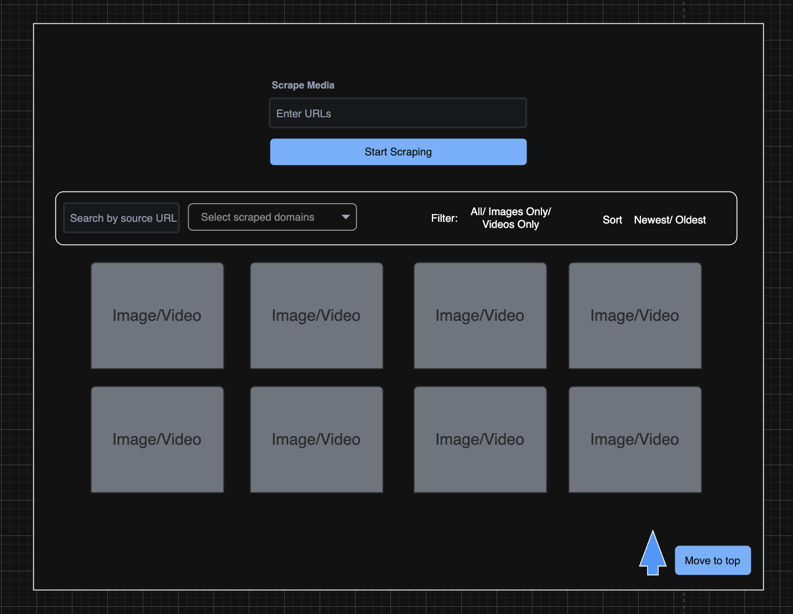
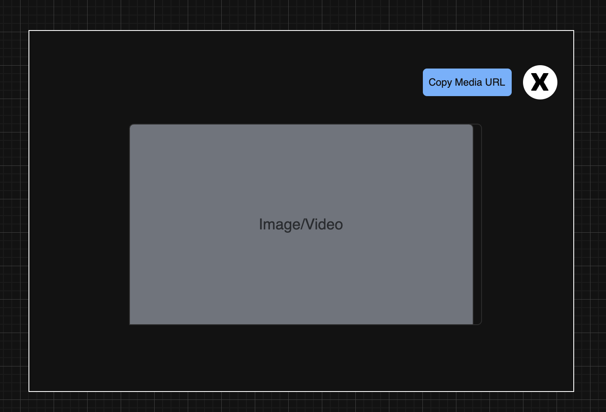
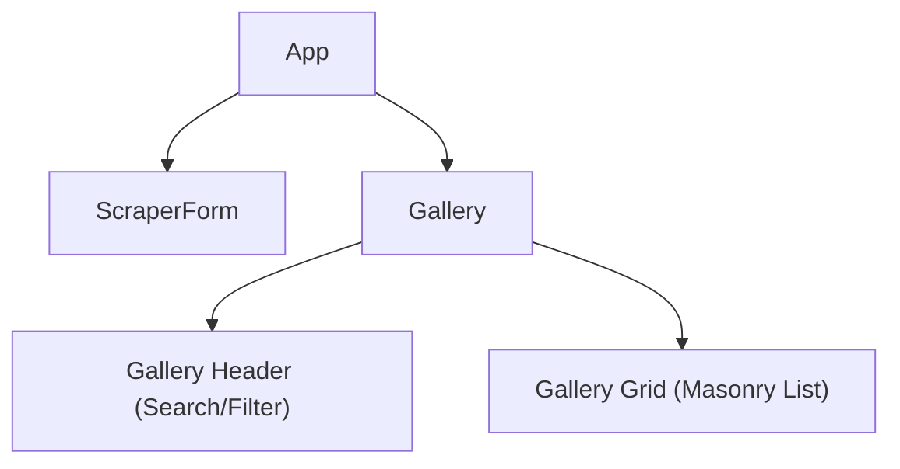
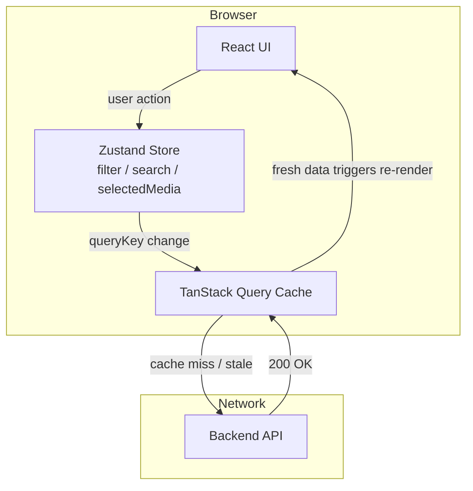
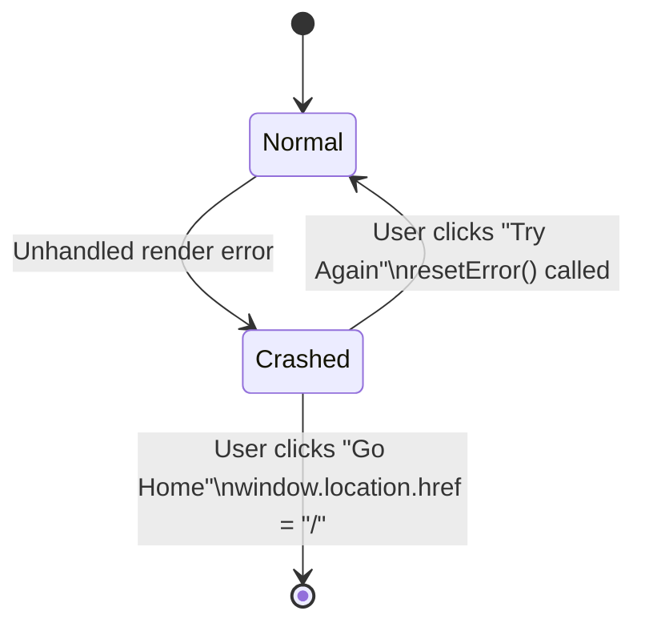

# Frontend System Design — Media Scraper

## 1. Requirements & Core Features

### 1.1 Core Functionality
- **Submission & Scraping**: Users can input multiple URLs, submit for scraping with visual feedback (spinners/loaders), and receive automatically refreshed data upon completion.
- **Browsing & Discovery**: Display scraped media in an adaptive masonry gallery. Users can infinitely scroll to load more, filter specifically by media type (images/videos), or search keywords across URLs and meta tags.
- **Interaction**: Users can click items to preview full-size details and click to copy the original media URL.

### 1.2 UX, Performance & Resilience
- **Performance Targets**: The application must be instantly interactive, natively lazy-load images off-screen, and debounce search keystrokes.
- **Graceful Degradation**: Clear boundary states must exist for empty galleries, offline network connections, generic API failures, and unhandled JS crashes.

---

## 2. Tech Stack

| Layer | Choice | Why |
|---|---|---|
| **Framework** | React 19 | Latest stable version of React |
| **Build tool** | Vite | Minimal config, fast HMR |
| **Global State** | Zustand | Scalable state management avoiding Context API over-renders |
| **Data fetching** | TanStack Query | `useInfiniteQuery` handles pagination + cache + refetch lifecycle |
| **Styling** | Tailwind CSS v4 | Utility-first; zero dead CSS at build; co-located styles |
| **Icons** | Lucide React | Tree-shakeable SVG icon set; no CSS dependency |
| **HTTP** | Native `fetch` | No extra dependency; sufficient for simple REST calls |
| **Language** | TypeScript | Strict types across layers |

---

## 3. User Interface

---

## 4. Architecture: Layer Model

| Component | Responsibility |
|---|---|
| **App** | Root layout orchestrating top-level routing, network status, and error boundaries. |
| **ScraperForm** | Handles incoming URLs, local validation logic, and triggering the backend scraper API. |
| **Gallery** | The main container layout coordinating the header and data visualization. |
| **GalleryHeader** | Manages the search input, filtering UI, and sort controls via global Zustand state. |
| **GalleryGrid** | Renders the highly optimized masonry layout of media items and the infinite scroll trigger. |

---

## 5. Application State & Data Flow

Before detailing optimizations, this is how data moves through the application layers successfully. We strictly segregate server cache state from UI/Client state.

- **Single source of truth for server state:** TanStack Query cache dynamically keyed by `["media", filter, debouncedSearch, sort, sourceUrl]`.
- **Global UI state:** Visual logic (active filter flags, un-debounced raw search terms, sorting flags, and currently selected media modals) are managed centrally in a **Zustand store** (`useMediaListStore`), fully decoupled from component prop drilling.

---

## 6. Performance & UX Optimizations

### 6.1 Infinite Scroll & Pagination
- **Observer Method**: Uses the browser's native `IntersectionObserver` attached to an invisible bottom target element to auto-detect when the user scrolls near the end of the viewport, enabling a seamlessly smooth continuous scrolling experience.
- **Debounced Fetching**: Bound to 100 ms to avoid rapid-fire HTTP loading loops during aggressive fast-scrolling.
- **Targeted Skeletons**: Skeleton cards mount inline below current items immediately while the API fetch resolves.

### 6.2 Debounced Search
- `debouncedSearch` only commits to the query state 500 ms after the user physically stops typing, avoiding unnecessary HTTP request spam per keystroke.

### 6.3 Scroll to Top Navigation
- A sticky floating action button intelligently appears only after the user scrolls past **3x the viewport height**, preventing UI clutter on initial load but allowing instant return navigation on massive galleries.

### 6.4 Lazy Loading & Network Resiliency
- `loading="lazy"` handles off-canvas image fetching natively dynamically pushed directly to browser logic.
- `refetchOnReconnect: true` automatically triggers stale data updates when waking laptops or reconnecting to network availability.

### 6.5 Masonry Layout Mechanics
- Items are strictly distributed into CSS flex vertical columns dynamically mapping derived screen breakpoints (1 column for Mobile, up to 4 for large desktops) rather than forcing fixed CSS un-even heights.

---

## 7. Edge Case Handling

| Scenario | Handler | Behaviour |
|---|---|---|
| **No media in DB** | `NoMediaFound` | Empty state illustration |
| **API fetch error** | `ListErrorState` | Inline error message in gallery area |
| **Unhandled JS crash** | `ErrorBoundary` | Full-screen recovery UI |
| **Browser offline** | `NetworkOffline` + `useNetworkStatus` | App UI stays mounted; auto-hides on reconnect |
| **Invalid URL input** | `isUrlsValid` | Rejects empty input, > 5 URLs, URLs > 200 chars, malformed format with inline error warning |

### Error Boundary — Recovery Flow

