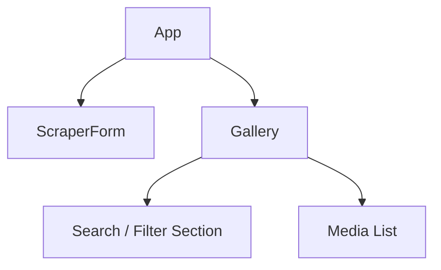
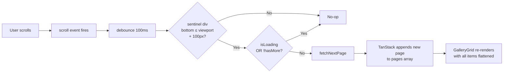
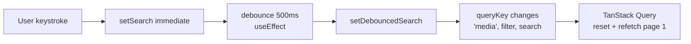
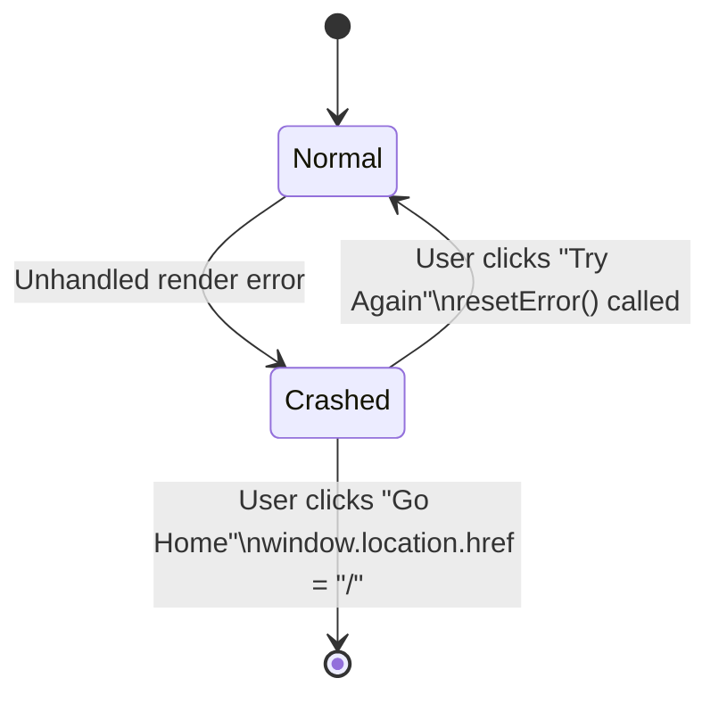
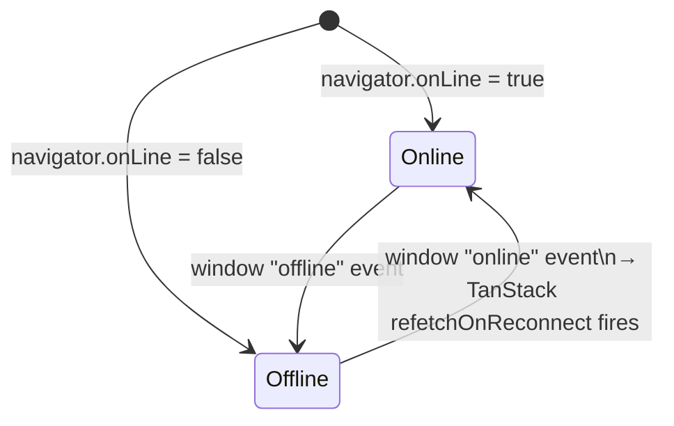
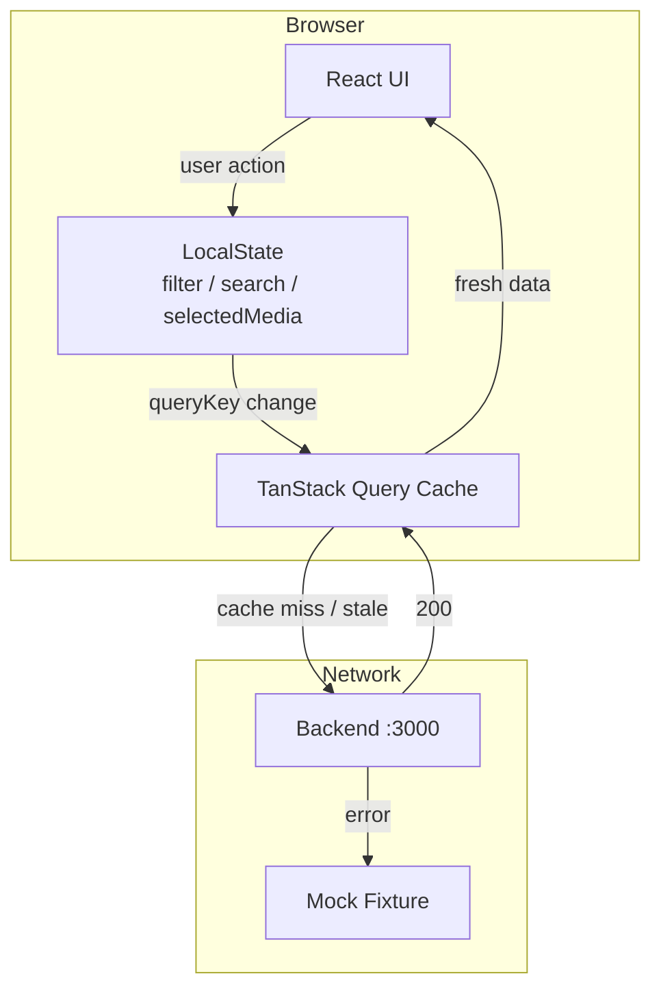

# Frontend System Design — Media Scraper

## 1. Requirements

### 1.1 Functional Requirements

| # | User can… |
|---|---|
| F1 | Enter one or more website URLs and submit them to be scraped for media |
| F2 | See a loading indicator while scraping is in progress |
| F3 | Browse all scraped images and videos in a responsive masonry gallery |
| F4 | Load more results automatically by scrolling to the bottom of the gallery |
| F5 | Filter the gallery to show only images, only videos, or all media |
| F6 | Search for specific media by keyword across URL, title, and alt text |
| F7 | Click any media item to open a full-size detail preview |
| F8 | Copy a media item's URL to the clipboard with a one-click confirmation |
| F9 | Jump back to the top of the page with a scroll-to-top button |
| F10 | See skeleton placeholders while the gallery is loading |
| F11 | See a clear empty state when no media has been scraped yet |
| F12 | See an error message in the gallery if data could not be fetched |
| F13 | See an offline notification banner when the browser loses internet connection |

### 1.2 Non-Functional Requirements

| # | Quality | Target |
|---|---|---|
| NF1 | **Performance** | Page loads and feels interactive in under 1.5 s |
| NF2 | **Responsiveness** | Gallery adapts to mobile, tablet, and desktop screen sizes |
| NF3 | **Search UX** | Search does not fire on every keystroke — waits until the user pauses typing |
| NF4 | **Scroll UX** | Next page loads smoothly without a manual "Load More" button |
| NF5 | **Data freshness** | Gallery automatically updates after a scrape completes |
| NF6 | **Resilience** | The app remains usable when the API is temporarily unavailable |
| NF7 | **Crash recovery** | Unexpected errors show a recovery screen without requiring a full browser reload |

---

## 2. Tech Stack

| Layer | Choice | Why |
|---|---|---|
| **Framework** | React 19 | Latest stable version of React |
| **Build tool** | Vite 8 | Minimal config, fast HMR |
| **Data fetching** | TanStack Query v5 | `useInfiniteQuery` handles pagination + cache + refetch lifecycle out of the box |
| **Styling** | Tailwind CSS v4 | Utility-first; zero dead CSS at build; co-located styles |
| **Icons** | Lucide React | Tree-shakeable SVG icon set; no CSS dependency |
| **HTTP** | Native `fetch` | No extra dependency; sufficient for simple REST calls |
| **Language** | TypeScript ~6 | Strict types across layers; compiled by Vite/SWC |
| **Testing** | Jest + Testing Library | Unit tests for hooks and components|
| **Linter** | Biome | Same toolchain as backend; single binary |

---

## 3. Architecture: Layer Model



## 4. Performance & UX Optimisations

### 4.1 Infinite Scroll



- **Sentinel element** (`ref={observerTarget}`) sits below the grid; no IntersectionObserver dependency (plain scroll event for broader browser support).
- Debounced at 100 ms to avoid rapid-fire during fast scrolling.
- `GallerySkeleton` renders below sentinel while `isFetchingNextPage` is true.
- "End of Gallery" pill shown when `!hasNextPage && allItems.length > 0`.

### 5.2 Debounced Search



- Raw `search` state updates instantly (controlled input, no lag).
- `debouncedSearch` only changes 500 ms after the user stops typing.
- Because `debouncedSearch` is part of the `queryKey`, changing it automatically busts the cache and refetches from page 1 — no manual invalidation needed.

### 6.3 Refetch on Reconnect

`useGetMediaList` sets:
```ts
refetchOnReconnect: true   // TanStack Query built-in
refetchOnWindowFocus: true // re-validates stale data when tab is re-focused
```

Combined with `useNetworkStatus`, the app both shows an offline banner **and** re-fetches fresh data the moment connectivity is restored.

### 6.4 Native Lazy Image Loading

```tsx

```

- All `` elements use the browser-native `loading="lazy"` attribute.
- Images below the fold are not fetched until they are about to enter the viewport.

### 6.5 Masonry Layout (`useMasonry`)

- Column count is driven by `window.innerWidth` with a `resize` listener:

| Breakpoint | Columns |
|---|---|
| < 640 px | 1 |
| ≥ 640 px (sm) | 2 |
| ≥ 1024 px (lg) | 3 |
| ≥ 1280 px (xl) | 4 |

- Items are distributed round-robin (`i % columnCount`) into CSS flex columns, giving a Pinterest-style layout with no external library.
- `useMemo` ensures column recomputation only on `items` or `columnCount` change.

### 6.6 Code Splitting (`React.lazy`)

```ts
const Header = React.lazy(() => import("./presentation/shared/Header"))
const NetworkOffline = React.lazy(() => import("./presentation/shared/NetworkOffline"))
```

Non-critical layout shells are lazy-loaded so the main bundle stays smaller and FCP is faster.

---

## 7. Edge Case Handling

| Scenario | Handler | Behaviour |
|---|---|---|
| **No media in DB** | `NoMediaFound` | Empty state illustration + prompt to scrape |
| **API fetch error** | `ListErrorState` | Inline error message in gallery area with retry affordance |
| **Unhandled JS crash** | `ErrorBoundary` | Full-screen recovery UI with "Try Again" (resets state) and "Go Home" (hard reload) |
| **Browser offline** | `NetworkOffline` + `useNetworkStatus` | Fixed toast banner at bottom; app UI stays mounted; auto-hides on reconnect |
| **API unreachable** | `fetchMedia` fallback | Catches fetch errors, returns filtered mock fixture so gallery still renders in dev |
| **Scrape API unreachable** | `scrapeMedia` fallback | Simulates 800 ms delay + returns `{ success: true }` for UI flow continuity |
| **Invalid URL input** | `isUrlsValid` in `useScraperForm` | Rejects empty input, > 5 URLs, URLs > 200 chars, malformed format with inline error message |
| **End of pages** | `EndOfGallery` pill | "End of Gallery" indicator when `!hasNextPage`; sentinel stops triggering |
| **Long scrape in progress** | Submit button disabled + spinner | Button shows `Loader2` spinner + `disabled` state during mutation pending |

### Error Boundary — Recovery Flow



### Network Status — State Machine



---

## 8. Data Flow Summary



- **Single source of truth for server state:** TanStack Query cache keyed by `["media", filter, debouncedSearch]`.
- **Local UI state** (filter, search, selectedMedia) lives in `useMediaList` — not in any global store (`useMediaListStore.ts` is intentionally empty, reserved for future use).
